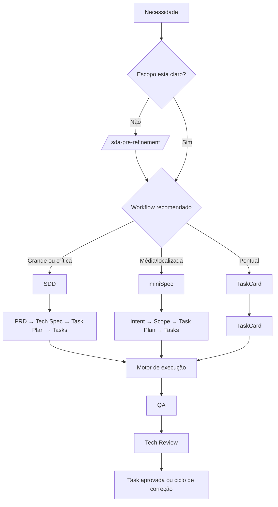

# Fluxo de utilização do AgentSpec

## 1. Escolha o workflow

| Cenário | Workflow | Entrada | Saída de planejamento |
|---|---|---|---|
| Feature grande, crítica, com múltiplas fases ou risco arquitetural | SDD | PRD | Tech Spec, Task Plan e tasks |
| Feature de porte médio e escopo localizado | miniSpec | Intent | Scope, Task Plan e tasks |
| Alteração única, pontual e bem delimitada | TaskCard | TaskCard | Uma task executável |
| Dúvida sobre tamanho ou escopo | Pré-refinamento | Brief da necessidade | Recomendação de workflow |

Execute `/sda-pre-refinement` antes do workflow quando a necessidade ainda precisar de discovery de produto ou de enquadramento de complexidade.

## 2. Planeje a feature

### SDD

1. `/sda-sdd-generate-prd` — define o que será entregue e por quê.
2. Opcionalmente, `/sda-generate-tech-alignment` — registra alternativas e alinhamento técnico.
3. Opcionalmente, para web/mobile, `/sda-generate-design` — produz `design.md`.
4. `/sda-sdd-generate-tech-spec` — define como implementar, incluindo estratégia de testes.
5. Opcionalmente, `/sda-challenge-spec` — estressa a Tech Spec contra código, domínio e ADRs.
6. `/sda-sdd-generate-task-plan` — cria o plano e as tasks atômicas.
7. `/sda-sdd-run-tasks` — executa as tasks.

### miniSpec

1. `/sda-minispec-generate-intent` — define o resultado esperado.
2. Opcionalmente, execute alinhamento técnico e design quando aplicáveis.
3. `/sda-minispec-generate-scope` — delimita a solução e as restrições.
4. Opcionalmente, `/sda-challenge-spec` — valida o Scope antes da decomposição.
5. `/sda-minispec-generate-tasks` — cria o plano e as tasks atômicas.
6. `/sda-minispec-run-tasks` — executa as tasks.

### TaskCard

1. `/sda-taskcard-generate` — descreve uma task pontual e seus testes.
2. `/sda-taskcard-run` — executa e valida a TaskCard.

## 3. Valide antes de decompor

Use `/sda-challenge-spec` quando a Tech Spec ou o Scope tiver decisão não trivial, novo domínio, terminologia nova, trade-off relevante ou tocar caminhos críticos. A skill pode ajustar o artefato, atualizar glossários e sinalizar candidatas a ADR.

Para mudanças triviais ou specs já revisadas profundamente, este passo pode ser pulado.

## 4. Execute as tasks

Todos os workflows convergem para o mesmo ciclo por task:

1. O executor implementa somente o escopo declarado.
2. O Gate 1 (`sda-qa-validator`) valida critérios de aceitação e executa a suíte de testes.
3. O Gate 2 (`sda-staff-architecture-review`) revisa o diff, arquitetura, ADRs, segurança e qualidade; não repete a validação funcional.
4. Achados críticos, altos ou médios retornam a task ao executor.
5. Achados baixos não bloqueiam: são registrados como débito técnico para tratamento posterior.
6. A aprovação conclui e registra a execução em `_run/`.

Em correções exclusivamente de revisão de código sem alteração comportamental, o orquestrador pode pular a revalidação QA e repetir apenas o Tech Review. Se houver dúvida, área crítica ou mudança estrutural, deve reexecutar QA.

Tasks só devem rodar em paralelo se a mesma fase comprovar independência no grafo de dependências, símbolos e arquivos tocados. Qualquer incerteza exige execução sequencial.

## 5. Trate ADRs de forma transversal

Durante a geração de Scope ou Tech Spec, decisões podem ser marcadas como candidatas. Uma ADR nunca é criada automaticamente.

Use `/sda-adr-create` apenas se todos os critérios forem atendidos:

- decisão transversal;
- tag canônica aplicável;
- alto custo de reversão;
- necessidade de contexto futuro;
- trade-off real entre alternativas.

Operações usuais: `/sda-adr-list`, `/sda-adr-show`, `/sda-adr-review`, `/sda-adr-supersede`, `/sda-adr-deprecate` e `/sda-adr-reindex`. Para um projeto existente, comece por `/sda-adr-bootstrap`.

## 6. Feche e evolua o fluxo

- Execute `/sda-debt-resolution` para quitar débitos não bloqueantes acumulados após o run.
- Execute `/sda-mine-rule-candidates` para consolidar sinais recorrentes dos runs e `/sda-curate-project-rules` para decidir se viram regra de projeto.
- Use `/sda-rule-create` quando já houver um tema de regra a ser escrito do zero.
- Use `/sda-testing-stack-bootstrap` para descobrir e registrar a stack de testes; consulte `/sda-testing-best-practices` para a doutrina de testes.
- Gere `/sda-backend-contract-handoff` quando a feature exigir integração backend → frontend.
- Use `/sda-docs-sync` para verificar documentação e `/sda-semantic-commit` antes do commit.

## Artefatos e paths

Use `{feature}` em kebab-case e `{version}` como `v1`, `v2` etc.

| Workflow | Artefatos principais |
|---|---|
| SDD | `docs/prds/features/{feature}/{version}/prd.md`; `docs/specs/features/{feature}/{version}/tech_spec.md`; `task_plan.md`; `tasks/` |
| miniSpec | `docs/specs/features/{feature}/{version}/intent.md`; `scope.md`; `task_plan.md`; `tasks/` |
| TaskCard | `docs/specs/features/{feature}/{version}/tasks/task-{nn}-{slug}.md` |
| Execução | `docs/specs/features/{feature}/{version}/_run/run-report.md` e `workflow-report.md` |
| ADR | `docs/adr/` e `docs/adr/INDEX.md` |

Os templates de path e as convenções são definidos em `rules/sda-*-workflow-rules.md`; altere as rules, não os skills, quando precisar mudar o destino ou o comportamento compartilhado.
